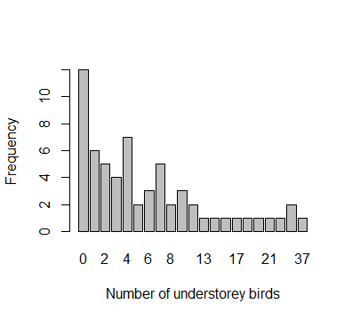
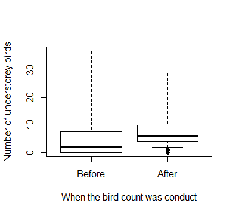
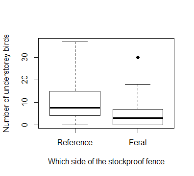
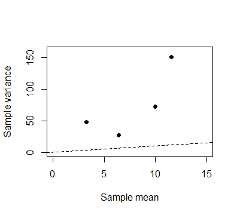
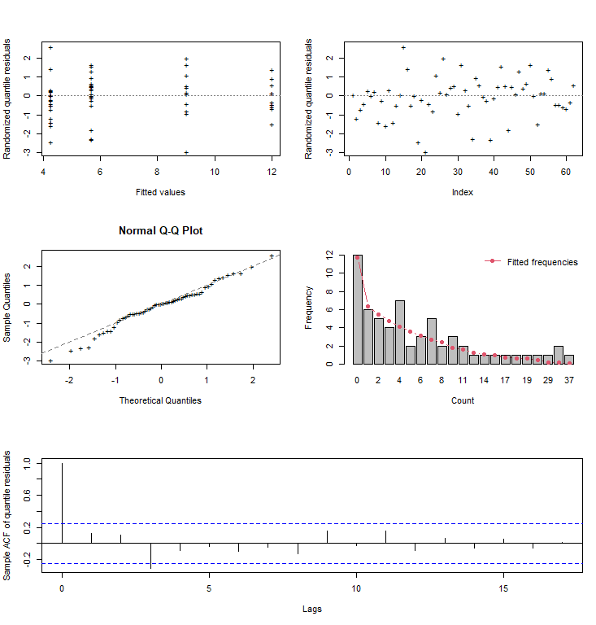
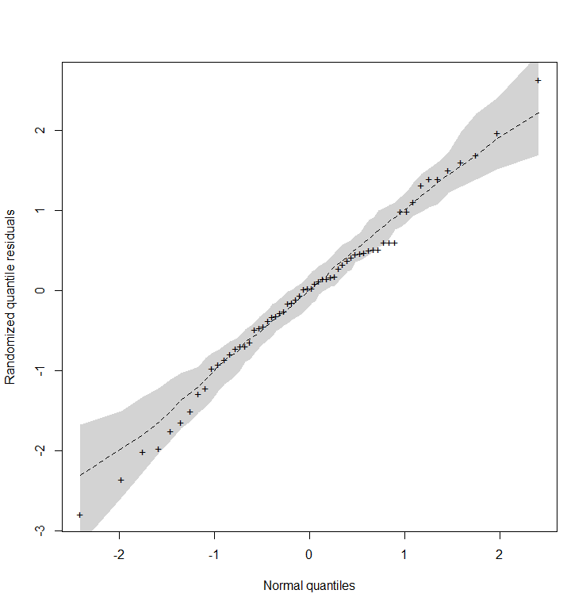

# `bergreg`: BerG Regression Model for Count Data

[](https://travis-ci.com/travis-ci/travis-web)

> Rodrigo M. R. Medeiros
> <rodrigo.matheus@live.com>, IME-USP

The `bergreg` package (in development) provide a set of functions for a complete regression analysis of count data, in which it is assumed that the dependent variable follows a BerG distribution. The BerG regression was proposed by Bourguignon and De Medeiros (2021), and can be used to fit count data with overdispersion, equidispersion (but are not Poisson-distributed), and underdispersion.

## Installation

You can install the current development version of `bergreg` from [GitHub](https://github.com/rdmatheus/bergreg) with:

``` r
devtools::install_github("rdmatheus/bergreg")
```
To run the above command, it is necessary that the `devtools` package is previously installed on R. If not, install it using the following command:

``` r
install.packages("devtools")
```
After installing the devtools package, if you are using Windows, install the most current [RTools](https://cran.r-project.org/bin/windows/Rtools/) program. Finally, run the command `devtools::install_github("rdmatheus/bergreg")`, and then the package will be installed on your computer.

## Example

This package provides a complete estimation and inference for the parameters. It also
provides diagnostic plots, useful for assessing the goodness-of-fit of the model. The implementation is straightforward and similar to other popular packages, like `betareg` and `glm`, where the main function is `bergreg()`. Below is an example of some functions usage and available methods.

``` r
library(bergreg)
```
There are currently two data sets available in the `bergreg` package, `grazing` and `bids`. To access the documentation associated with this data, use `help(grazing)` and `help(bids)`, respectively. In this example we use the `grazing` dataset.

```r
# Data visualization (For description: ?grazing)
```





``` r
# Fit a double model (mean and dispersion) 

fit <- bergreg(birds ~ when + grazed | when + grazed, data = grazing)

## For bergreg() documentation:
?bergreg

# Print

fit
#> 
#> Call:
#> bergreg(formula = birds ~ when + grazed | when + grazed, data = grazing)
#> 
#> mean Coefficients:
#> [1]  2.1981771  0.2861585 -0.7489044
#> 
#> dispersion Coefficients:
#> [1]  2.43710069 -0.03712163 -0.44592813
#>
#> In addition, Log-lik value: -178.4034 
#> AIC: 368.8069 and BIC: 381.5697

# Summary

summary(fit)
#>
#> Call:
#> bergreg(formula = birds ~ when + grazed | when + grazed, data = grazing)
#>
#> Summary for quantile residuals:
#>        Mean Std. dev.  Skewness Kurtosis
#>    0.022816  0.977821 -0.033684 3.669114
#> 
#> ---------------------------------------------------------------
#> Mean model with log link:
#> ---------------------------------------------------------------
#> 
#> Coefficients:
#>             Estimate Std. Error z value  Pr(>|z|)    
#> (Intercept)  2.19818    0.31373  7.0066 2.441e-12 ***
#> whenAfter    0.28616    0.32352  0.8845   0.37642
#> grazedFeral -0.74890    0.32411 -2.3107   0.02085 *
#>
#> ---------------------------------------------------------------
#> Dispersion model with log link:
#> ---------------------------------------------------------------
#> 
#> Coefficients:
#>              Estimate Std. Error z value  Pr(>|z|)    
#> (Intercept)  2.437101   0.317344  7.6797 1.595e-14 ***
#> whenAfter   -0.037122   0.330650 -0.1123    0.9106
#> grazedFeral -0.445928   0.339223 -1.3146    0.1887    
#> ---
#> Signif. codes:  
#>   0 ‘***’ 0.001 ‘**’ 0.01 ‘*’ 0.05 ‘.’  0.1 ‘ ’ 1
#> 
#> ----------------------------------------------------------------
#> 
#> In addition, Log-lik value: -178.4034
#> AIC: 368.8069 and BIC: 381.5697

# Test for constant dispersion

disp_test(fit)
#>            Score      Wald Lik. Ratio  Gradient
#> value  2.5735882 1.7394284  1.9181896 2.0715307
#> pvalue 0.2761547 0.4190713  0.3832396 0.3549546

# Plot

## Randomized quantile residuals
layout(matrix(c(1, 3, 5, 2, 4, 5), 3, 2))
plot(fit, which = 1:5, ask = FALSE)     
layout(1)
```


``` r
## Use type = "pearson" to obtain a summary for the Pearson residuals.

# Normal probability plot with simulated envelope 

envelope <- berg_envel(fit)
plot(envelope)
```



``` r
## Use type = "pearson" to obtain the normal probability plot with simulated
## envelope for the Pearson residuals
```

Currently, the methods implemented for "bergreg" objects are
``` r
methods(class = "bergreg")
#>
#> [1] AIC          coef         logLik       model.matrix plot         predict      print       
#> [8] residuals    summary      vcov        
#> see '?methods' for accessing help and source code
```
